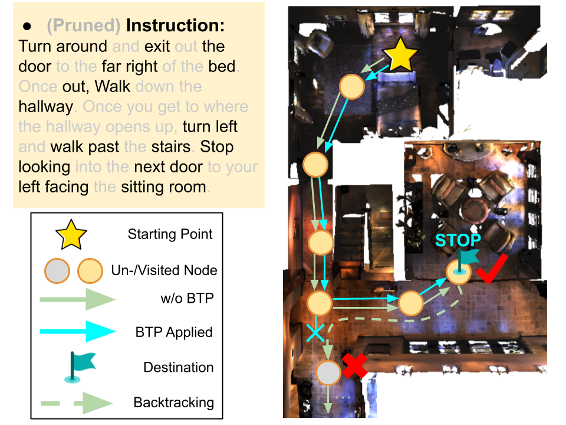
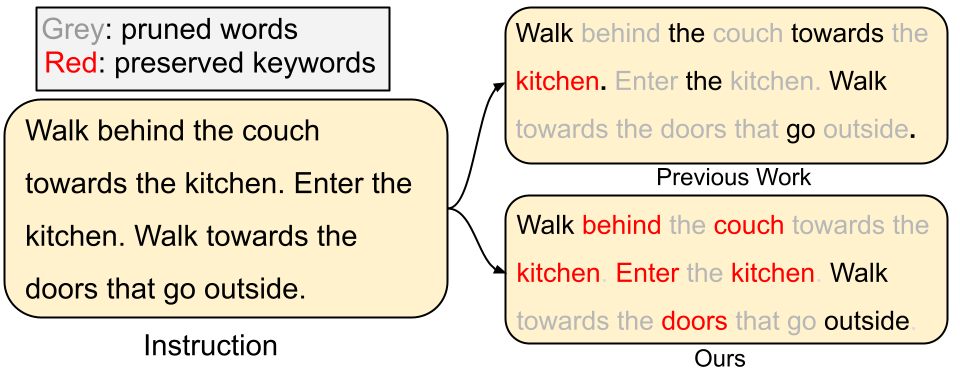

# VLN Token Pruning - BGP/BTP/VPP
Code of our paper "Walk and Read Less: Improving the Efficiency of Vision-and-Language Navigation via Tuning-Free Multimodal Token Pruning"
- A token pruning strategy designed specifically for VLN tasks, reducing instruction, view, and global map input sizes.

Update 30th March:
Our paper is under the review process of an ACL cycle. We are going to upload part of our code once our arXiv upload (estimated to be done in these two weeks) is done. Please wait for the exciting content coming soon!

## Teasers:

Our proposed pruning strategies reduced unnecessary backtracking due to the loss of pruned visual information while preserving key information in the instruction under low token budgets.

The Vocabulary Priority Pruning (VPP) preserved key navigation information under a low token budget while general pruning strategies couldn't.
More coming soon!
